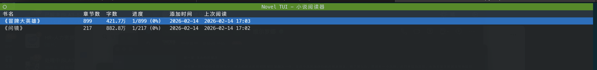
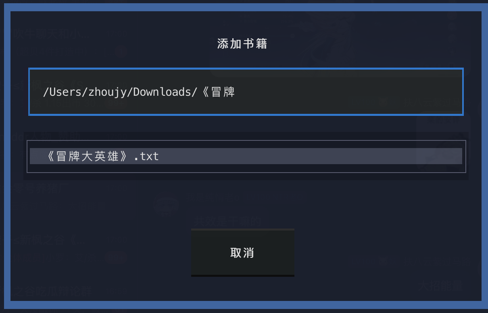
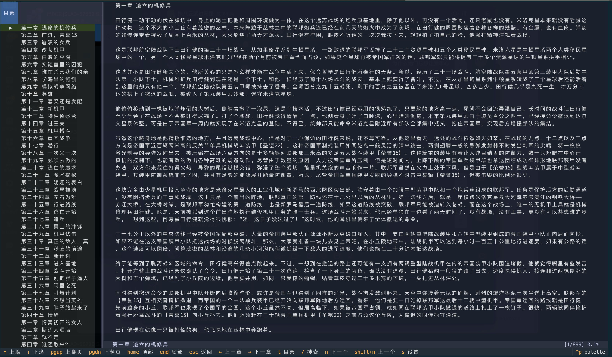

# Novel TUI

一个基于 [Textual](https://textual.textualize.io/) 的终端小说阅读器，专为 `.txt` 格式的中文小说设计。

## 功能预览

### 书架管理

管理你的小说库：查看书名、章节数、字数、阅读进度和时间。按 `a` 添加书籍，`d` 删除，`Enter` 打开阅读。



### 添加书籍

内置交互式文件选择器，输入路径自动补全，支持键盘浏览目录。选中 `.txt` 文件后自动检测编码（UTF-8/GB18030/GBK/Big5）并解析章节结构。



### 沉浸阅读

自定义行宽和段落间距，`←`/`→` 切换章节，`t` 打开目录侧边栏跳转，`/` 全文搜索并高亮匹配，`n`/`N` 跳转结果。阅读进度每 30 秒自动保存。



## 安装

需要 Python 3.12+，推荐使用 [uv](https://docs.astral.sh/uv/)：

```bash
git clone https://github.com/BOSSzz/novel-tui.git
cd novel-tui
uv sync
```

## 使用

```bash
uv run novel-tui
```

### 快捷键

**书架页面：**

| 按键 | 功能 |
|------|------|
| `a` | 添加书籍 |
| `d` | 删除书籍 |
| `Enter` | 打开书籍 |
| `q` | 退出 |

**阅读页面：**

| 按键 | 功能 |
|------|------|
| `↑` / `↓` | 逐行滚动 |
| `PageUp` / `PageDown` | 翻页 |
| `Home` / `End` | 跳转首尾 |
| `←` / `→` | 上一章 / 下一章 |
| `t` | 切换目录侧边栏 |
| `/` | 打开搜索 |
| `n` / `N` | 下一个 / 上一个搜索结果 |
| `s` | 阅读设置 |
| `q` / `Esc` | 返回书架 |

## 开发

```bash
# 安装开发依赖
uv sync

# 运行测试
uv run pytest

# 运行单个测试
uv run pytest tests/test_parser.py::test_parse_chapters -v
```

## 技术栈

- [Textual](https://textual.textualize.io/) — TUI 框架
- [platformdirs](https://github.com/tox-dev/platformdirs) — 跨平台数据目录
- SQLite — 本地数据存储

## License

MIT
